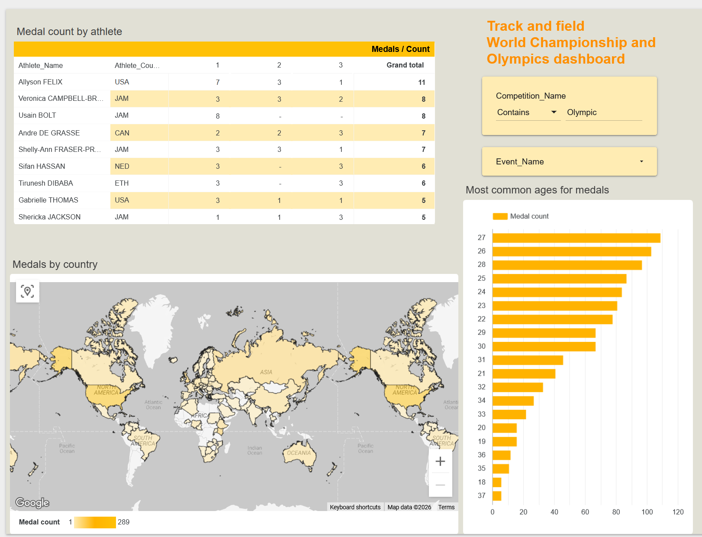

# World Athletics Cloud Data Pipeline & BI Dashboard


## The Final Product
**[Click here to view the live Looker Studio Dashboard](https://lookerstudio.google.com/reporting/8ee43461-48fc-46d7-a9e6-3fdf5a065190)**



## Project Overview
This project is an end-to-end **Cloud Data Engineering** pipeline designed to extract, transform, and visualize track and field results from the World Athletics website.

The goal was to build a highly resilient, cloud-native ELT (Extract, Load, Transform) architecture that handles messy, real-world track and field data (e.g., varying measurement units, status codes like DQ/DNF, and multi-athlete relay events) and models it for downstream Business Intelligence.

The scraper specifically extracts top 8 results from chosen competition groups. In this case, i chose three: Olympic Games, World Athletics Championships and World Athletics Indoor Championships. 


## Architecture & Tech Stack
* **Extraction (Web Scraping):** `Python` (Selenium, BeautifulSoup, Requests)
* **Data Warehouse:** `Google BigQuery`
* **Data Modeling:** Kimball Star Schema (DDL & SQL)
* **Business Intelligence:** `Looker Studio`

## Detailed Pipeline Workflow

### Stage 1: Website Analysis & Setup
Before writing the extraction logic, I analyzed the DOM structure of the World Athletics (WA) website to identify how their internal APIs and URL parameters functioned. I discovered that competitions are categorized by internal Group IDs. I mapped these into a configuration dictionary to drive the automated scraping loop.

```
COMPETITION_GROUPS = {
    "Olympic Games": 5,
    "World Athletics Championships": 6,
    "World Athletics Indoor Championships": 12
}
```

### Stage 2: Building the Dimension Table (dim_competitions)
The first phase of the ELT process focuses on extracting metadata for every finished competition within the target groups.
1. **Extraction:** The script navigates the calendar pages and extracts the raw HTML table rows.
2. **Transformation (In-flight):** I utilized Regular Expressions to parse concatenated location strings into separate Venue and Country dimensions, and generated an Is_Indoor boolean flag based on the competition name.
3. **Loading:** The cleaned data is streamed directly into the BigQuery dim_competitions table.

### Stage 3: The Cloud-Native Results Scraper (fact_results)
1. **Querying the Cloud:** The script connects to BigQuery and runs a SELECT statement to fetch the Competition_IDs loaded in Stage 2.
2. **Dynamic Event Parsing:** For each competition it requests the specific WA results URL, parses the HTML `<select>` dropdown menu and extracts every Competition_ID
3. **Granular Extraction:** It iterates through every event, scraping the Top 8 results.
4. **Handling Edge Cases and initial transformations:** If the script detects a "Relay" event, it explodes the concatenated string of athletes into four distinct rows to ensure accurate medal counts per athlete in the downstream dashboard. It also strips '.' out of 'Place' column to ensure safe INT parsing and converts birth date format to YYYY-MM-DD.

### Stage 4: The Data Warehouse Transformation (The "Gold" Layer)
To optimize the data for Looker Studio, I created a final SQL View (`gold_results_dashboard`) that acts as the serving layer.
* **Regex Date Parsing:** The competition dates were stored as messy strings (e.g., `30 JUL-08 AUG 2021`). I used `REGEXP_EXTRACT` to isolate the final date and parsed it into a true `DATE` type to calculate the athlete's exact age on the day of the result.
* **Polymorphic Data Handling:** The `Mark` column contained race times, jump distances, and status codes (DQ, DNS, DNF). I used a `CASE` statement to split this into a `Clean_Mark` column and a `Result_Status` column, allowing the BI dashboard to filter out disqualified athletes without crashing.

## How to run locally

1. Install dependencies:
``` pip install -r requirements.txt ```
2. Set up GC credentials:
```gcloud auth application-default login```
3. Create a .env file in the root directory:
```
PROJECT_ID="your-gcp-project-id"
COMPETITIONS_TABLE="your-project.dataset.dim_competitions"
RESULTS_TABLE="your-project.dataset.fact_results"
```
4. Execute competitions pipeline:
``` python scrapers\competitions_scraper.py ```
5. Execute results pipeline:
``` python scrapers\results_scraper.py```

